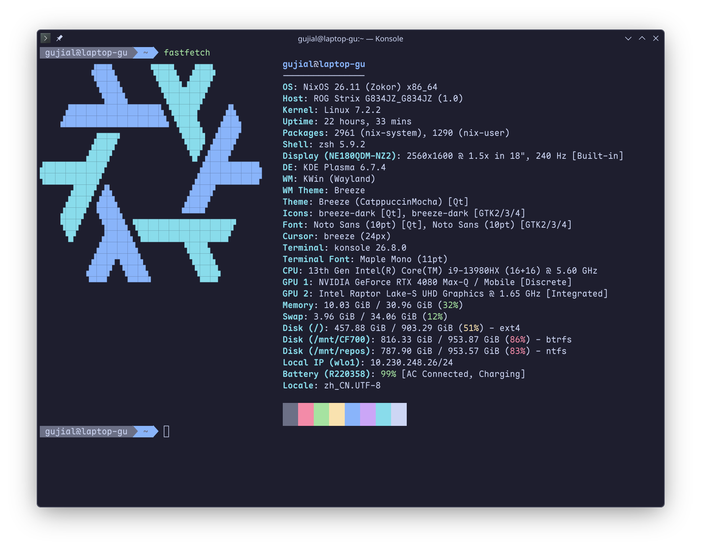
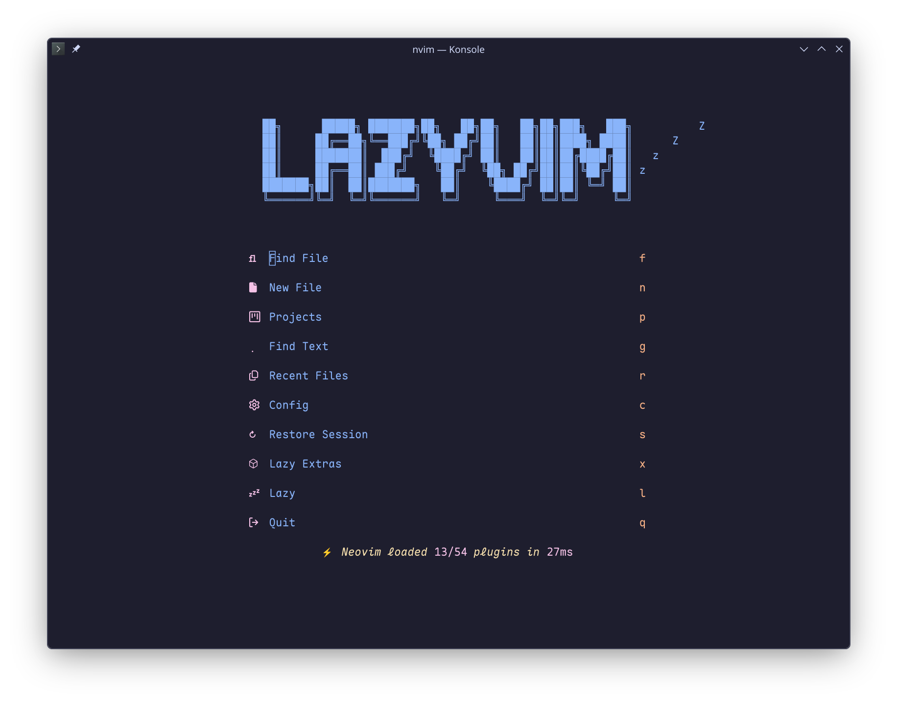
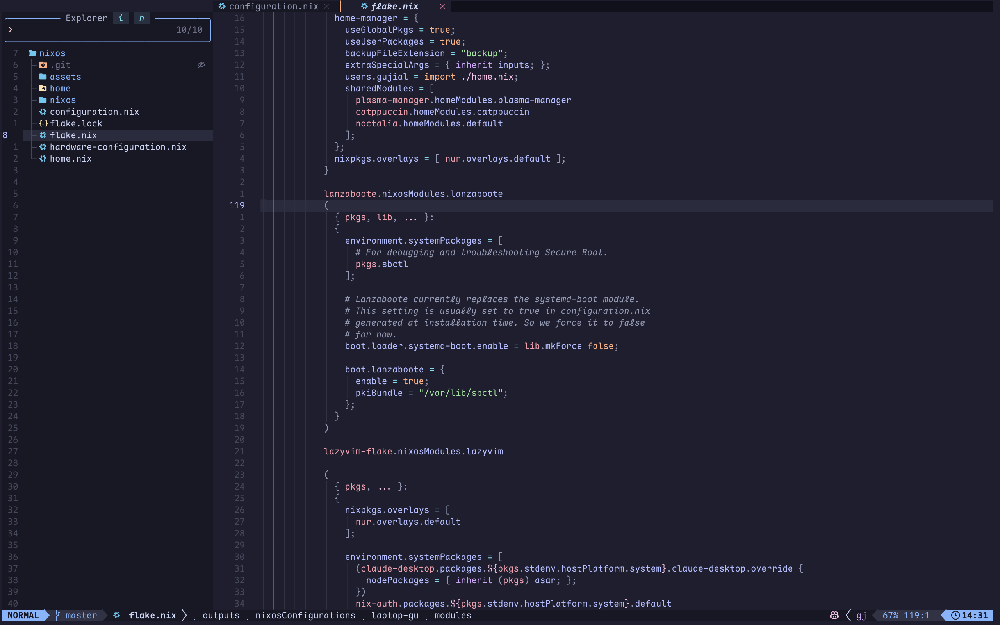
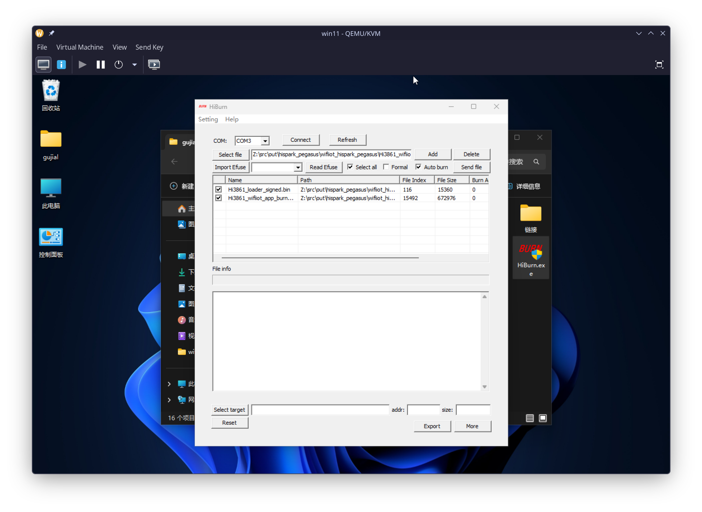

# 日志

## 实习日志——第一天

**实习日期：2026年8月29日**
**实习内容：配置 Linux 编译环境**



今天是实习的第一天，主要学习和完成了鸿蒙智能硬件开发所需要的 Linux 编译环境配置。由于后续 OpenHarmony 源码编译、程序构建等工作主要在 Linux 环境下完成，因此今天的主要任务是搭建稳定的 Linux 开发环境，并熟悉 Linux 虚拟机、网络连接、 SSH 远程登录以及虚拟机基本维护等操作。

首先，我检查了自己电脑当前的操作系统环境。我的主机已经安装了 NixOS ，因此不需要按照培训文档重新安装 Linux 操作系统，可以直接在现有的 NixOS 环境中配置开发工具。根据自己的使用习惯，我选择使用 NeoVim 作为主要编辑器，并采用 NixVim + LazyVim + NeoVim 的组合进行配置。插件通过 NixVim 引入，再使用 Lua 完成具体的插件和编辑器功能配置，最后通过 `flake.nix` 将整个配置打包成 Nix 模块，并安装到操作系统中。

通过这部分配置，我进一步了解了 NixOS 的声明式配置思想。与传统 Linux 系统中手动安装软件、修改配置文件的方式相比， NixOS 可以通过配置文件描述整个系统环境，使开发环境具有较好的可复现性和可维护性。同时，我也将自己的 Vim 配置和 NixOS 系统配置分别进行版本管理，方便以后进行修改、备份以及在其他环境中重新部署。

> vim 配置位于 [`lazyvim-nix`](https://github.com/gujial/lazyvim-nix)



> 系统配置位于 [`nixos-conf`](https://github.com/gujial/nixos-conf)



参考文档中 VMware 的说明，我在我的系统中安装了类似的开源虚拟机管理软件 `libvirt` + `virt-manager`，并通过 `virt-manager` 创建了一个 Windows 11 LTSC 的虚拟机。虚拟机的配置包括 8 核 CPU、16 GB 内存、挂载实体 1 TB 硬盘以及桥接网络连接。通过桥接网络，虚拟机可以通过 virtiofs 服务和 WinFSP 提供的 FUSE 功能挂载物理机中的文件系统，从而方便后续的烧录工作。

为了避免后续环境配置过程中出现问题导致整个开发环境损坏，我还学习了虚拟机快照和克隆技术。快照可以记录虚拟机当前的状态，在后续配置过程中如果出现错误，可以直接回滚到之前的状态；克隆则可以复制出一台新的虚拟机，其中完整克隆可以使新虚拟机独立于原来的虚拟机，更适合作为稳定的开发环境备份。通过实际操作，我认识到在配置复杂开发环境之前进行备份非常重要，可以有效降低环境损坏后重新安装和配置的成本。

通过今天的实践，我认识到一个稳定的开发环境是后续进行软件开发和系统编译的重要基础。尤其是 OpenHarmony 这种源码规模较大、依赖较多的系统项目，对编译环境的稳定性和一致性要求较高。因此，在正式开始 OpenHarmony 源码编译之前，需要先确保 Linux 编译环境、网络连接、源码目录、工具链以及相关依赖都能够正常工作，为后续的鸿蒙智能硬件开发打下基础。

## 实习日志——第二天

**实习日期：2026年8月30日**
**实习内容：安装 git 、获取官方示例源码**

今天是实习的第二天，在前一天完成 Linux 编译环境基本配置的基础上，今天主要学习了 Git 的基本使用方法，并完成了 OpenHarmony 智能硬件相关示例代码的获取和初步了解。今天的工作主要包括 Git 安装与配置、 SSH 密钥配置、 Gitee 账号配置、示例代码仓库获取以及 OpenHarmony 相关代码和资料的整理。

首先，我学习了 Git 的基本概念。 Git 是目前软件开发中广泛使用的分布式版本控制系统，可以用于管理项目源代码以及记录代码的修改历史。与直接复制和修改代码相比，使用 Git 可以更加方便地进行版本管理，在多人协作开发时也可以通过分支、合并等功能对不同开发者的代码进行管理。同时，通过 Git 提交记录还可以追踪项目的开发过程，当代码出现问题时也可以根据历史版本进行定位和恢复。

在实际开发过程中， OpenHarmony 本身是一个规模较大的开源项目，其源代码包含大量的子系统、组件和开发工具，因此使用 Git 获取和管理源代码是非常重要的基础工作。通过今天的学习，我也认识到，在进行大型开源项目开发之前，首先需要熟悉代码仓库的获取、更新以及版本管理方式。

由于我的主要开发环境是 NixOS ，因此我没有按照 Windows 环境中的安装方式下载 Git 安装程序，而是直接使用 NixOS 的软件包管理体系进行安装。 `nixpkgs` 中已经提供了 Git ，因此可以直接将 Git 加入系统环境中。安装完成后，通过 git --version 检查 Git 是否能够正常运行。


在 Git 基本环境配置完成后，我进一步配置了 Git 得用户信息。 Git 在创建提交记录时需要知道提交者的用户名和邮箱，因此需要使用 git config --global 设置全局的 `user.name` 和 `user.email` 。这些信息会记录在之后创建的 Git 提交中。

除了基本的 Git 用户信息配置之外，我还学习了 SSH 密钥的配置方法。通过 SSH 密钥，可以在本地计算机和代码托管平台之间建立更加方便的身份认证方式。相比每次通过 HTTPS 操作仓库时输入账号和密码，配置 SSH 公钥后，可以直接使用 SSH 地址访问具有权限的代码仓库。

随后，我注册并配置了 Gitee 账号。 Gitee 是国内常用的代码托管平台，本次实习所使用的 HiHope 、 HiSpark 等相关 OpenHarmony 示例代码也主要通过 Gitee 提供。完成账号配置后，我将本地生成的 SSH 公钥添加到 Gitee 账号中，从而为后续通过 SSH 方式访问代码仓库做好准备。

在了解 Git 的基本配置之后，我开始查找本次实习所需要的 OpenHarmony 官方及相关开发资料。首先了解了 HiHope IoT 物联网设备相关文档仓库，其中包含 HiSpark Wi-Fi IoT 智能家居开发套件的资料。 HiSpark Wi-Fi IoT 套件基于海思 Hi3861 芯片设计，包含多个功能单板和配套模块，与前一天学习的 Hi3861 智能硬件开发内容能够对应起来。

通过资料整理，我进一步了解到润和满天星 Pegasus 智能家居 OpenHarmony 开发套件相关资料，其中包含智能家居套件的完整例程以及 OpenHarmony master 版本的例程。这些代码和文档对于后续进行 Hi3861 开发具有较高的参考价值。

随后，我重点获取了 HiSpark 物联网 IoT 套件样例代码。该项目托管在 Gitee 上，可以通过 Git 直接克隆到本地 。 Linux 环境下首先检查 Git 是否安装成功，如果没有安装，则通过系统软件包管理工具安装 Git 。之后进入用于保存源码的目录，并执行 `git clone` 命令获取 `hispark-pegasus-sample` 仓库。

代码下载完成后，我使用目录查看命令检查仓库是否成功获取。通过查看本地目录，可以看到 Git 已经将远程仓库完整下载到本地。通过这一过程，我实际掌握了从代码托管平台查找仓库、获取仓库地址、使用 Git 克隆代码以及检查本地代码等基本操作。

在 Windows 环境下，文档还介绍了通过 Git for Windows 获取代码的方法。虽然我主要使用 Linux 和 NixOS 环境进行开发，但通过学习 Windows 版本的操作流程，我了解到 Git 的基本使用方式在不同操作系统之间具有较强的一致性。 Windows 用户可以安装 Git Bash ，然后通过 git clone 获取相同的示例代码。

除了 HiSpark Pegasus 示例代码之外，我还了解了其他相关代码仓库，例如 `easy_wifi` 等。这些项目主要用于提供 Wi-Fi 等物联网功能的示例或相关实现。通过查看这些不同的仓库，我开始认识到一个完整的鸿蒙智能硬件项目往往并不是单独由一个程序文件组成，而是由多个组件、库、示例程序以及配置文件共同构成。

在获取代码之后，我对 OpenHarmony 相关源码的组织形式进行了初步了解。 OpenHarmony 项目的代码规模比较大，不同目录承担着不同的功能。对于目前的我来说，还不能完全理解每一个模块的具体实现，因此今天主要以了解整体结构和查阅 README 、项目文档为主，先建立对整个项目的宏观认识。

通过今天的学习，我还认识到代码仓库和开发文档之间具有密切的联系。仅仅获取源码并不能立即进行开发，还需要结合 README 、开发指南、硬件资料以及示例代码理解项目的构建方式、运行环境和硬件要求。尤其是 Hi3861 这类物联网芯片，代码运行不仅与软件有关，还与具体的开发板、芯片型号、外围传感器和烧写方式有关，因此后续学习需要将软件源码和硬件资料结合起来。

今天的实践让我对 Git 和 Gitee 的使用有了更加具体的认识，也成功完成了 OpenHarmony 智能硬件示例代码的获取。相比前一天主要进行 Linux 环境配置，今天开始真正接触后续开发所需要的源码。通过 Git 获取代码只是第一步，后续还需要进一步学习 OpenHarmony 的源码构建流程，了解 Hi3861 所对应的编译配置，并尝试对示例程序进行编译和运行。

通过今天的学习，我认识到在进行大型系统开发时，良好的代码管理和开发环境同样重要。 Git 不仅是一个下载代码的工具，更是整个软件开发过程中进行版本控制和协作开发的重要基础。后续我将继续熟悉 OpenHarmony 的源码结构和构建工具，并尝试将今天获取的示例代码实际编译到 Hi3861 开发板上，为后续进行鸿蒙智能硬件应用开发做好准备。

## 实习日志——第三天

**实习日期：2026年8月31日**
**实习内容： OpenHarmony 编译环境配置、Hi3861 工具链提取及程序编译烧录**

今天是实习的第三天，主要学习并完成了 OpenHarmony 在 Hi3861 开发板上的编译、固件生成以及烧录工作。通过前两天对 Linux 开发环境、 Git 以及 OpenHarmony 源码的学习，我已经获取了相关项目源码，因此今天主要围绕源码编译环境的搭建和最终程序在开发板上的运行展开。

培训资料中推荐使用 Docker 作为 OpenHarmony 的编译环境，以减少由于 Ubuntu 系统版本或软件包升级造成的环境差异。参考资料中的方法，需要首先安装 Docker ，然后拉取已经配置好的 Hi3861 开发镜像。例如可以通过 `docker pull` 获取 `hispark/hi3861_hdu_iot_application:1.0` 镜像，再通过容器进行源码编译。资料中也介绍了使用容器启动 OpenHarmony 编译环境、进入容器以及执行 `hb set` 和 `hb build -f` 完成编译的过程。

由于我实际使用的是 NixOS ，因此没有直接长期依赖 Docker 容器作为开发环境，而是先按照培训资料的方法拉取已经配置好的 Hi3861 OpenHarmony Docker 镜像。通过分析镜像中的开发环境，我发现其中已经包含了 Hi3861 编译所需要的一些原厂工具和依赖，因此进一步从镜像中提取了 Hi3861 SDK 所使用的 RISC-V 交叉编译工具链，并将其放入项目仓库中。这样做可以将关键的编译器与项目源码一起管理，避免因为系统环境变化导致工具链版本不一致。

在获得工具链之后，我尝试使用 Nix 的方式重新组织整个 OpenHarmony 的编译环境。在项目仓库中新建了 `flake.nix` 文件，并使用 `nixpkgs` 创建开发环境 `devShell` 。在 `flake.nix` 中配置了 Python 、 SCons 、 GNU Make 、 clangd 、 Bear 等编译和开发工具，同时针对 OpenHarmony 的 `hb` 构建工具配置了 Python 运行环境。

在配置过程中遇到了一个比较特殊的问题。 OpenHarmony 的 `hb` 工具依赖较老版本的 `prompt_toolkit`，而新版本的 Python 包已经移除了一些旧接口，因此无法直接使用 `nixpkgs` 中默认的新版本。为了解决这个问题，我在 Flake 中单独构建了 `prompt_toolkit 1.0.14`，并对部分旧代码进行了兼容性修改，使其能够在当前 Python 环境下运行。同时配置了 PyYAML 、 requests 、 pycryptodome 、 ecdsa 、 kconfiglib 等 `hb` 所需要的 Python 依赖。

```nix
{
      # hb 硬编码依赖 prompt_toolkit==1.0.14 (使用了已在新版本移除的 style_from_dict API)
      prompt_toolkit_legacy = pkgs.python3Packages.buildPythonPackage rec {
        pname = "prompt_toolkit";
        version = "1.0.14";
        pyproject = true;
        build-system = [ pkgs.python3Packages.setuptools ];
        src = pkgs.python3Packages.fetchPypi {
          inherit pname version;
          sha256 = "0bv249ni511lqwjbg6yrvxnv0h76axfx3wnrflb045sb3cxl2rnc";
        };
        postPatch = ''
          find . -name '*.py' -exec sed -i \
            -e 's/from collections import Mapping/from collections.abc import Mapping/' \
            -e 's/from collections import MutableMapping/from collections.abc import MutableMapping/' \
            {} +
        '';
        propagatedBuildInputs = with pkgs.python3Packages; [
          six
          wcwidth
        ];
        doCheck = false;
      };
}
```

此外，我还对 `hb` 命令进行了封装。由于 `hb` 本身主要作为 Python 模块运行，而不是一个独立的二进制程序，因此通过 Shell 脚本自动寻找项目中的 `src/build/lite/hb` 目录，并设置正确的 `PYTHONPATH` 后再启动 `hb`。这样可以避免每次进入项目后手动配置 Python 模块搜索路径，提高了开发环境的可复现性。

```nix
let
        hb = pkgs.writeShellScriptBin "hb" ''
        search_dir="$PWD"
        while [ "$search_dir" != / ]; do
          if [ -d "$search_dir/src/build/lite/hb" ]; then
            export PYTHONPATH="$search_dir/src/build/lite''${PYTHONPATH:+:$PYTHONPATH}"
            exec ${pythonEnv}/bin/python -m hb "$@"
          fi
          if [ -d "$search_dir/build/lite/hb" ]; then
            export PYTHONPATH="$search_dir/build/lite''${PYTHONPATH:+:$PYTHONPATH}"
            exec ${pythonEnv}/bin/python -m hb "$@"
          fi
          search_dir="$(dirname "$search_dir")"
        done

        echo "hb: cannot locate src/build/lite/hb from $PWD" >&2
        exit 1
      '';
in
{
  ...
}
```

对于 Hi3861 编译器，我在开发环境中设置了 `HI3861_TOOLCHAIN` 环境变量，使其默认指向项目中的 `toolchains/gcc_riscv32` 目录，并将其中的 `bin` 目录加入 `PATH`。这里使用的是 Hi3861 原厂提供的 RISC-V GCC 工具链。由于 OpenHarmony Hi3861 SDK 对编译器版本以及 `libgcc` 等运行库存在一定要求，因此不能简单使用系统中的其他版本 RISC-V GCC ，而需要保持工具链版本与项目要求一致。

完成 Flake 配置后，通过进入 Nix DevShell ，使项目获得完整的 OpenHarmony 编译环境。进入环境后可以直接使用 hb 、 SCons 、 GNU Make 等工具，同时设置必要的 `CFLAGS` 和 `CXXFLAGS`，解决部分旧版 OpenHarmony 源码在较新的编译器环境下产生的警告或兼容性问题。

> 完整环境配置位于 [`flake.nix`](https://github.com/gujial/hi3861_hdu_iot_application/blob/master/flake.nix)

随后开始进行实际编译。首先进入 OpenHarmony 源码目录，通过 `hb set` 配置项目和目标开发板，再执行 `hb build -f` 开始完整编译。编译过程中可以看到系统调用 RISC-V 交叉编译器对 Hi3861 相关代码进行编译，并最终在 `out` 目录中生成对应的固件文件。培训资料中给出的标准流程同样是通过 `hb set` 选择工程和开发板，然后使用 `hb build -f` 完成编译。

完成编译后，我进一步进行了固件烧录。由于我的主要开发环境是 Linux/NixOS ，而 Hi3861 官方提供的 HiBurn 烧录工具主要运行在 Windows 环境，因此没有强行在 Linux 下运行烧录工具，而是使用 Windows 虚拟机完成烧录。首先将物理机中的代码仓库挂载到 Windows 虚拟机中，然后在 Windows 中使用 HiBurn 工具选择对应的串口和固件文件，将原本位于 `/dev/ttyUSB0` 的开发板直通到虚拟机的 `COM3` 端口，并将程序烧录到 Hi3861 开发板。

```xml
<--! 虚拟机 USB 设备直通配置，根据 lsusb 的输出设置 -->
<hostdev mode="subsystem" type="usb" managed="yes">
  <source>
    <vendor id="0x1a86"/>
    <product id="0x7523"/>
  </source>
  <address type="usb" bus="0" port="2"/>
</hostdev>

```



通过今天的实践，我完整地走通了从 OpenHarmony 源码到开发板程序运行的整个流程，即 源码获取 → 编译环境配置 → 工具链配置 → OpenHarmony 编译 → 固件生成 → Windows 虚拟机烧录 → 开发板运行。相比单纯按照教程执行命令，我对 OpenHarmony 编译系统、交叉编译工具链以及不同操作系统之间的开发工具协作有了更加深入的认识。

今天最大的收获是认识到了嵌入式开发环境并不只是安装几个编译工具那么简单，编译器版本、 Python 依赖、构建工具、环境变量以及目标芯片的 SDK 都可能影响最终的编译结果。通过使用 Nix Flake 对这些依赖进行统一管理，可以使 OpenHarmony 的开发环境更加稳定和可复现，也为后续进一步修改源码、开发 Hi3861 应用程序以及进行调试打下了基础。

## 实习日志——第四天

**实习日期：2026年9月1日**
**实习内容： Windows 开发环境搭建、 DevEco Device Tool 使用与烧录调试流程学习**

今天的培训内容主要围绕 Windows 侧开发环境的搭建展开，重点学习了 Hi3861 开发板在 Windows 平台下的标准开发流程，包括 DevEco Device Tool 的安装、 SDK 导入、工具链配置、固件编译、串口烧录以及串口日志监视等内容。虽然我前面已经在 NixOS 环境下完成了 OpenHarmony 的编译和烧录，但为了理解官方推荐流程以及后续在不同平台之间切换开发时的操作方式，今天仍然系统梳理了 Windows 环境下的完整工作链路。

培训资料首先介绍了 DevEco Device Tool 的组成和使用方式。该工具以 VS Code 插件的形式运行，能够在 Windows 下完成工程导入、编译、烧录和调试等常见操作，同时与 Ubuntu 或其他 Linux 编译环境配合使用。按照资料中的说明， Windows 侧需要安装 DevEco Device Tool 、 Python 、 VS Code 以及相关插件，并保证安装路径尽量简短且不包含中文，以避免工具链识别和路径处理时出现问题。文档中特别强调了 Windows 路径长度限制，这一点对于 OpenHarmony 这种目录层级较深的项目尤其重要，如果将仓库放在过深目录下，很容易在编译时触发路径超过 260 字符的问题。

在阅读和整理导入工程流程时，我重点关注了 SDK 目录结构和工具链路径配置方式。资料要求先下载 Hi3861 SDK 和 DevTools_Hi3861V100 工具包，再通过 DevEco Device Tool 的“导入工程”功能选择 SDK 所在目录，随后在 SOC 、开发板和框架选项中选择 Hi3861 以及 hb 构建框架。由于我之前已经在 Linux/NixOS 环境中接触过 `hb set` 和 `hb build -f` 这套编译流程，因此今天对照 Windows IDE 中的图形化配置界面后，我更清楚地理解了图形界面背后实际上仍然对应着同一套 OpenHarmony 构建体系，只是通过 IDE 将工程导入、编译参数配置和日志展示进行了封装。

今天另一个重要学习内容是 Windows 侧的串口驱动安装和烧录流程。培训资料中使用 CH340/CH341 串口驱动为 Hi3861 开发板建立串口通信，再通过 DevEco Device Tool 中的 `upload_port` 选项选择对应端口进行固件下载。结合我前一天在 Windows 虚拟机中通过 HiBurn 完成烧录的经验，我进一步理解了开发板烧录并不只依赖编译本身，还依赖驱动是否正确安装、串口是否被其他工具占用、复位时机是否准确等一系列细节。资料中还提到 Monitor 功能与烧录共用串口，因此如果串口监视窗口未关闭，往往会导致烧录失败，这类细节问题在实际嵌入式开发中非常常见。

除编译和烧录外，我还学习了 DevEco Device Tool 中的 Monitor 、 Stack Analysis 和 Image Analysis 等功能。 Monitor 可以直接查看开发板复位后的串口输出，对于检查程序是否启动、 Wi-Fi 是否初始化成功、传感器是否正常响应都非常有帮助；而栈分析和镜像分析则可以从资源占用角度帮助开发者定位问题，例如评估任务栈空间、观察镜像中各个段和符号的大小分布。这些功能对于资源受限的 Hi3861 平台尤其重要，因为嵌入式项目不仅要实现功能，还需要兼顾 RAM 、 Flash 和任务栈的使用情况。

通过今天的学习，我对 Windows 平台下的 OpenHarmony 开发工作流有了更完整的认识。虽然我自己的主要开发方式仍然更偏向 Linux/NixOS 下的命令行与声明式环境管理，但 Windows 侧的 DevEco Device Tool 在工程导入、串口烧录、日志监控和基础调试方面确实更直观，也更适合初学者快速上手。对我来说，今天最大的收获并不是重新配置一套重复的开发环境，而是把 Linux 下的命令行构建流程和 Windows 下的图形化开发流程联系起来，建立起对整个 Hi3861 开发链路的整体理解。

## 实习日志——第五天

**实习日期：2026年9月2日**
**实习内容： Harmony OS 物联网应用开发实战-1——GPIO 按键与环境监测示例**

今天进入了 Harmony OS 物联网应用开发实战的第一部分，培训重点从环境搭建转向具体的板级应用开发。结合 Pegasus/Hi3861 相关资料以及仓库中的示例代码，我实际完成了 GPIO 按键示例 `button_example` 和环境监测示例 `environment` 的学习与整理。这一天的内容让我开始真正从“能把工程编译出来”过渡到“能理解板上外设如何被程序控制以及多个模块如何组合成完整应用”。

首先，我查看了 Pegasus 示例代码的目录结构，确认不同功能都被拆分成独立的例程目录，例如 `07_gpiobutton`、 `10_i2caht20`、 `12_ssd1306` 和 `18_environment` 等，每个目录都包含自己的 `BUILD.gn`、示例源码和说明文档。通过这些目录结构，我逐渐理解了 OpenHarmony 在 Hi3861 上的基本应用开发模式：先选择目标示例，再在编译配置中启用对应模块，最后通过串口输出或外设运行现象观察程序结果。和桌面程序不同，这类嵌入式应用更加依赖引脚功能、硬件连接关系以及底层驱动配置。

在按键示例 `button_example` 中，我重点学习了 GPIO 输入功能的使用方式。这个示例主要体现了按键状态读取和输入响应逻辑，相比之前常见的 LED 闪烁程序，按键示例更强调程序对外部输入信号的感知。通过阅读代码和例程说明，我认识到 GPIO 不仅可以作为输出控制外设，也可以作为输入接口接收按键等外部信号，而输入和输出在初始化方式、状态读取和程序逻辑组织上都有明显区别。

随后，我重点学习了环境监测综合示例 `environment`。这个例程把多个外设组合在一起实现一个完整的小型物联网场景： AHT20 通过 I2C 采集温湿度数据， MQ2 通过 ADC 读取气体传感器模拟值， OLED 负责显示温度、湿度和气体浓度信息，蜂鸣器则在启动时或特定场景下进行提示。与单一外设示例相比，这个综合案例更接近真实应用，也让我直观体会到嵌入式开发中“传感器采集 + 本地显示 + 告警提示”这种软硬件协同模式。

在学习环境监测例程的过程中，我还注意到编译配置的重要性。该示例依赖 I2C 和 PWM 等底层硬件能力，如果相关配置项没有在 SDK 中启用，就可能在链接阶段出现未定义符号错误。因此，今天我进一步认识到嵌入式开发中“代码正确”和“配置正确”同样重要：即使应用层逻辑没有问题，只要底层外设支持未开启，程序仍然无法正常运行。这种问题在物联网项目中十分常见，也提醒我后续阅读和调试示例时不能只盯着业务代码本身。

通过今天的实战学习，我对 Hi3861 上 Harmony OS 应用开发的认识更加具体了。第五天的重点不再是泛泛了解所有基础外设，而是围绕按键输入和环境监测这两个实际完成的示例，理解 GPIO 输入、传感器采集、数据显示与蜂鸣器提示之间的联系。这也为后续继续学习 I2C、 UART 和 OLED 等更细化的外设内容打下了基础。

## 实习日志——第六天

**实习日期：2026年9月3日**
**实习内容： Harmony OS 物联网应用开发实战-2——I2C、UART 与 OLED 示例学习**

今天继续进行 Harmony OS 物联网应用开发实战，不过本次实际完成的内容主要集中在 I2C、 UART 和 OLED 这几个基础模块，而培训资料中剩余的联网和网络通信部分则放到后续几天继续学习。结合 Pegasus 示例代码和相关说明文档，我重点整理了 `10_i2caht20`、 `11_uart` 和 `12_ssd1306` 这几个示例，进一步理解了传感器通信、串口调试和显示驱动在物联网开发中的作用。

首先，我学习了 I2C 相关内容，重点是 AHT20 温湿度传感器示例。这个例程展示了如何通过 I2C 总线与外部传感器进行通信，包括初始化 I2C 设备、发送测量指令以及读取温湿度数据等过程。通过阅读示例，我对 I2C 这种总线型接口有了更具体的认识：它不像 GPIO 那样只处理简单高低电平，而是需要按照设备地址和通信时序与外设交互，因此更接近真正意义上的驱动开发。同时我也注意到，Hi3861 默认配置并不会自动启用 I2C 支持，如果没有打开相关配置项，就会在链接阶段出现未定义符号错误，这再次说明底层配置对嵌入式开发的重要性。

随后，我学习了 UART 串口通信示例。串口是嵌入式开发中最常用的调试和数据交换手段之一，既可以用于程序运行日志输出，也可以用于设备之间的简单通信。通过查看 UART 示例，我进一步理解了串口初始化、发送与接收数据的基本流程，也更加认识到串口在开发阶段的重要价值：很多时候即使图形界面不可用、网络尚未配置完成，只要串口能正常工作，开发者就可以通过日志定位程序运行状态和错误原因。

在 OLED 相关内容中，我重点学习了 SSD1306 驱动示例。这个例程不仅演示了如何通过 I2C 驱动 OLED 屏幕，还提供了字符显示、图形绘制和位图刷新等接口。与前一天环境监测例程中的“调用现成显示功能”相比，今天更进一步理解了底层显示驱动本身的实现思路，例如屏幕缓冲区、逐帧刷新以及字符和图像数据如何映射到显示区域。通过这个示例，我认识到 OLED 不只是一个简单的输出设备，而是很多物联网终端进行本地交互和状态展示的重要窗口。

把 I2C、 UART 和 OLED 这几个模块联系起来看，我逐渐体会到它们在实际项目中的分工： I2C 更偏向与传感器和外设芯片通信， UART 负责调试与基础数据传输， OLED 则用于将采集结果或系统状态直接展示给用户。这三类接口分别承担了“采集”“调试”“显示”的不同角色，也正是构成嵌入式交互闭环的重要基础。

通过今天的学习，我对 Hi3861 上 Harmony OS 的外设驱动层有了更清晰的理解。第六天的重点不是网络协议或云端通信，而是把 I2C、 UART 和 OLED 这些后续开发中会频繁使用的基础能力先掌握清楚。这样在后续继续学习 Wi-Fi 、 MQTT 、 HTTP 等联网内容时，我就可以把更多注意力放在系统集成和业务逻辑上，而不是再回头补基础外设知识。
