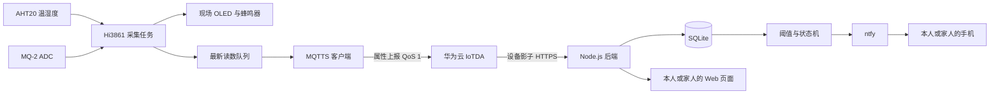

# Hi3861 环境监测系统项目文档

## 1. 项目概述

本项目面向家庭环境安全看护，重点服务独居老人、行动不便者及其家人。系统由放置在家中的 Hi3861 监测设备和供本人或家人使用的 Web 应用组成：设备持续采集温度、湿度和 MQ-2 燃气传感器电阻，在现场通过 OLED 展示信息，并在发现异常时使用蜂鸣器提醒居住者；同时将数据上传华为云 IoTDA，由 Web 服务进行远程监测和阈值判断，再通过 ntfy 将告警推送到本人或家人的手机。

系统采用“现场提醒 + 远程通知”的双通道思路。现场蜂鸣器不依赖用户查看手机，适合行动不便或不熟悉智能设备的居住者；远程通知让不在家的家人及时获知持续高温、低温、湿度异常或疑似易燃气体泄漏，并通过电话确认、联系邻居或物业、返回现场等方式进行处置。本系统用于辅助发现风险，不能替代符合消防规范的可燃气体报警器、烟雾报警器或紧急呼叫设备。

正式代码位于 `src/applications/environment_monitor`：

- `device`：Hi3861 设备程序、云连接和配置生成工具；
- `web`：Web 页面、Node.js 后端、SQLite 数据库及自动化测试；
- `BUILD.gn`：OpenHarmony 正式应用构建入口。

### 1.1 项目目标

1. 持续监测住宅内的温度、湿度和燃气传感器变化，不因互联网断开而停止本地采集和显示。
2. 在异常发生时尽快通过蜂鸣器提醒屋内人员，减少老年人或行动不便者错过危险信号的可能性。
3. 通过 MQTT 3.1.1、TLS 1.2 和 QoS 1 将有效读数安全上传华为云 IoTDA。
4. 让本人或家人通过 Web 页面查看最新数据、历史趋势、设备状态和告警记录。
5. 允许家人依据季节、房间和居住者需求设置温湿度与燃气电阻的上下限和恢复缓冲。
6. 在超限和恢复正常时通过 ntfy 推送到手机，并在临时失败后重试。
7. 将账号凭据、设备密钥和访问令牌保留在本地环境文件中，避免提交到版本库。

### 1.2 项目范围

系统当前面向一套住宅监测点，即一台 HiHope HiSpark Pegasus 开发板和一个本地 Web 实例，适合先在卧室、客厅或厨房附近进行原型验证。燃气数据表示 MQ-2 传感器电阻，单位为 kΩ；传感器电阻与气体浓度并非简单同向关系，且未经预热、标定和环境补偿时不能换算为可靠的 ppm 浓度。

当前固件已实现可配置的温湿度本地报警，以及标定后可显式启用的燃气电阻本地报警。燃气异常使用连续三短声，温湿度异常使用单次长声。为防止未经标定产生误导，燃气报警默认关闭。Web 保存阈值时通过 IoTDA `SetThresholds` 同步命令下发到在线设备；设备校验、持久化并确认后，后端才保存相同规则。恢复缓冲只用于 Web 告警状态机。

## 2. 系统需求

### 2.1 功能需求

| 编号 | 功能需求 | 验收标准 | 优先级 |
|---|---|---|---|
| FR-01 | 采集温度和湿度 | AHT20 有效时持续获得有限数值；读取失败时不上传伪造数据 | 高 |
| FR-02 | 采集燃气电阻 | ADC 有效时计算并显示 kΩ 电阻；无效时显示错误且不上传该组数据 | 高 |
| FR-03 | 本地显示与报警 | OLED 显示三项数据；温湿度异常时蜂鸣器鸣响；完成标定后，疑似易燃气体泄漏也应触发独立且明显的蜂鸣器报警 | 高 |
| FR-04 | Wi-Fi 与云连接 | 自动连接 Wi-Fi、同步时间并使用 MQTTS 接入 IoTDA；断线后指数退避重连 | 高 |
| FR-05 | 属性上报 | 默认每 30 秒向指定服务上报温度、湿度和燃气电阻，QoS 为 1 | 高 |
| FR-06 | 数据查询与保存 | 后端轮询设备影子，校验时间和属性后写入 SQLite，保留 30 天读数 | 高 |
| FR-07 | Web 数据展示 | 本人或家人输入管理令牌后可查看最新值、历史趋势、陈旧状态和告警记录 | 高 |
| FR-08 | 阈值管理与下发 | 家人可设置三项指标的启用状态、上下限和恢复缓冲；在线设备校验、持久化并确认后，后端保存相同规则；非法修改整体拒绝 | 高 |
| FR-09 | 告警判断 | 首次越界产生告警，持续越界不重复告警，越过恢复缓冲后产生恢复事件 | 高 |
| FR-10 | ntfy 推送 | 向本人或家人的手机按事件顺序发送告警和恢复消息；失败后退避重试，重启后继续处理 | 高 |
| FR-11 | 访问控制 | 所有 `/api/` 接口要求 Bearer 管理令牌，错误令牌返回 JSON 格式的 401 响应 | 高 |
| FR-12 | 配置生成 | 从私有环境变量生成固件头文件，并拒绝明显错误的 MQTT、证书和间隔配置 | 高 |

### 2.2 非功能需求

| 编号 | 非功能需求 | 设计约束或指标 |
|---|---|---|
| NFR-01 | 安全性 | MQTTS 使用 TLS 1.2 并校验服务端证书；云和 Web 凭据不进入前端包或 Git |
| NFR-02 | 可靠性 | 采集与网络任务解耦；只保留最新待发读数；通知状态、阈值和重试队列持久化 |
| NFR-03 | 时效性 | 设备默认 30 秒上报，后端默认 10 秒轮询，浏览器默认 5 秒刷新 |
| NFR-04 | 数据质量 | 拒绝缺失、非数值、越界、未来时间及乱序数据；过期读数不触发新报警 |
| NFR-05 | 可部署性 | Web 接口、数据库路径、轮询周期和第三方服务均由环境变量指定 |
| NFR-06 | 可维护性 | 设备端与 Web 端位于正式应用目录；关键阈值和云接口逻辑具备自动化测试 |
| NFR-07 | 资源约束 | Hi3861 不保存历史队列；后端历史查询限制为最近 180 条，页面告警限制为最近 40 条 |
| NFR-08 | 易用性 | 居住者无需操作即可获得现场提醒；家人端页面应使用明确中文状态、醒目的异常信息和较少操作步骤 |
| NFR-09 | 家庭可用性 | 断网时仍保留本地监测；恢复联网后自动重连；系统应能区分“环境正常”和“数据长时间未更新” |

### 2.3 外部依赖

- Hi3861/OpenHarmony 固件构建环境；
- AHT20、MQ-2、SSD1306 OLED 和蜂鸣器；
- 可访问 NTP UDP 123 和 IoTDA MQTTS TCP 8883 的 Wi-Fi；
- 华为云 IoTDA 产品、设备、产品模型及 IAM 读取权限；
- Node.js 24、npm 和支持内置 SQLite 的运行环境；
- ntfy 服务及可选的主题访问令牌。

## 3. 系统设计

### 3.1 总体架构



### 3.2 设备端设计

设备采集任务负责传感器初始化、周期采样、本地显示和蜂鸣器控制。在家庭场景中，本地提醒是互联网不可用时的最低保障，因此采集任务不依赖云任务。AHT20 或 ADC 读取失败时跳过云上报，避免将默认值当成真实数据。温度、湿度和燃气电阻的本地上下限由私有设备配置生成；燃气报警只有在显式启用且读数有效时才参与判断，并用连续三短声与温湿度单次长声区分。启用前仍需完成传感器预热、基线测量和实际模块标定。

云任务独立完成以下工作：

1. 连接 Wi-Fi 并等待网络可用；
2. 使用多个候选 NTP 服务器同步时间；
3. 使用根 CA 校验 IoTDA 服务器证书；
4. 用 Device ID、Client ID 和派生密码完成 MQTT 鉴权；
5. 从容量为 1 的消息队列获取最新读数并上报；
6. 连接失败后按 2、4、8、16、32 秒退避重试。

上报主题为：

```text
$oc/devices/{device_id}/sys/properties/report
```

上报报文为：

```json
{
  "services": [
    {
      "service_id": "Environment",
      "properties": {
        "temperature": 25.6,
        "humidity": 48.2,
        "gas_resistance": 12.3
      }
    }
  ]
}
```

`configure_device.py` 从本机环境变量生成被 Git 忽略的 `environment_config.h`。生成前检查 MQTT 地址、Device ID 与 Client ID 的关系、Client ID 时间戳、64 位 HMAC 密码格式、CA PEM、Wi-Fi 字段长度和上报间隔。脚本只能验证结构，不能确认派生密码是否使用了华为云设备当前密钥。

### 3.3 云端与 Web 后端设计

后端使用 IAM 用户名和密码自动获取项目级 Token，也支持短期 `IOTDA_AUTH_TOKEN`。Token 在有效期内缓存；IoTDA 返回 401 后清除缓存，下一轮重新认证。

后端读取指定设备的影子，从配置的服务 ID 和属性映射中提取三项指标。只有时间合法、属性齐全且为有限数值的数据才进入数据库。SQLite 保存以下内容：

- `readings`：按云端上报时间唯一保存读数；
- `settings`：三项阈值及恢复缓冲；
- `states`：每项指标当前的 normal、low 或 high 状态；
- `alerts`：告警、恢复事件、投递状态、重试次数和下次重试时间。

后端提供两个主要接口：

| 方法与路径 | 功能 | 成功响应 |
|---|---|---|
| `GET /api/status` | 获取最新数据、历史、阈值、状态和告警 | HTTP 200 JSON |
| `PUT /api/thresholds` | 校验全部阈值，通过 IoTDA 同步命令下发，设备确认后原子保存 | HTTP 200 `{"ok":true}` |

所有 API 都要求 `Authorization: Bearer <ADMIN_TOKEN>`。管理令牌仅保存在浏览器当前页面内存中。

### 3.4 告警状态机

以温度上限 35°C、恢复缓冲 0.5°C 为例：

- 温度不高于 35°C 时保持正常；
- 温度高于 35°C 时进入 high 并产生一次告警；
- high 状态下，温度仍高于 34.5°C 时保持 high，不重复通知；
- 温度降至 34.5°C 或更低时恢复 normal，并产生一次恢复通知。

下限采用对称规则。阈值关闭时，如果指标原先处于异常状态，会产生“监测已关闭”的状态变化事件。过期读数仍可展示，但不会触发新告警。

### 3.5 安全设计

1. `device.env`、Web `.env` 和生成的固件配置不提交到 Git。
2. 设备端保存的是 IoTDA 派生 MQTT 密码，原始 DeviceSecret 不写入源码。
3. MQTT 使用 TLS 1.2、服务器证书校验和 8883 端口。
4. Web 后端只允许 HTTPS 第三方接口；仅 localhost 调试允许 HTTP。
5. 管理令牌至少 16 位，并使用定长比较降低简单时序差异。
6. 阈值请求限制为 8 KiB，静态文件路径经过规范化，防止目录穿越。

### 3.6 已知设计边界

- 设备影子只保存最新属性，后端可能错过两次轮询之间的短暂超限；
- 后端停机期间的每一条历史上报无法从设备影子恢复；
- ntfy 请求超时但服务端已收到时，重试可能产生重复消息，事件编号可用于识别；
- 当前按一个数据库对应一台设备设计，多设备需要增加设备维度和租户隔离；
- MQTT 设备同步命令要求设备在线并在 20 秒内响应；设备离线时本次阈值保存失败。

## 4. User Stories

主要角色包括：住在监测住宅中的老人或行动不便者、在外地或工作场所关注其安全的家人，以及负责安装、标定和维护设备的维护者。

### Story 1：无需操作的现场提醒

**作为** 独居老人或行动不便者，**我希望** 环境异常时设备自动发出清晰的蜂鸣提示，**以便** 即使没有查看手机或打开网页，也能意识到风险并采取开窗、关闭气源或求助等措施。

验收条件：温湿度越过本地阈值时蜂鸣器工作且 OLED 显示异常类型；燃气报警在完成标定并实现设备端规则后，使用比普通状态提示更易识别的报警模式；断网不影响现场采集与报警。

### Story 2：家人查看实时环境

**作为** 不在现场的家人，**我希望** 在手机或电脑浏览器查看家中的最新温度、湿度和燃气电阻，**以便** 了解居住环境和设备是否仍在工作。

验收条件：使用正确管理令牌后显示三项最新值、上报时间和数据是否陈旧；错误令牌不能访问数据。

### Story 3：查看历史变化

**作为** 家人，**我希望** 查看近期环境趋势，**以便** 判断高温、低温或湿度异常是短暂波动还是持续问题，并据此调整空调、加湿器或通风安排。

验收条件：页面按时间顺序展示最近 180 条有效读数；重复或乱序上报不产生错误的历史点。

### Story 4：设置适合家庭的报警阈值

**作为** 家人或维护者，**我希望** 根据季节、房间用途和居住者身体状况设置各项阈值，**以便** 在及时提醒与减少误报之间取得平衡。

验收条件：合法设置一次性保存；下限不小于上限、超出量程或缓冲过大的设置整体拒绝，原配置保持不变。

### Story 5：家人接收异常通知

**作为** 不在现场的家人，**我希望** 温湿度异常或燃气传感器达到报警条件时收到手机推送，**以便** 立即联系本人、邻居或物业，必要时返回现场或联系应急服务。

验收条件：正常到异常的状态变化产生一条告警；持续异常不重复产生；推送包含指标、数值、阈值、时间和事件编号。

### Story 6：确认环境恢复

**作为** 已收到告警的用户，**我希望** 数据恢复后收到通知，**以便** 确认异常已经解除。

验收条件：数据跨过恢复缓冲后产生恢复事件；恢复事件不能越过仍在等待重试的原告警。

### Story 7：识别设备离线并自动恢复

**作为** 家人或维护者，**我希望** 系统明确显示数据长时间未更新，并在 Wi-Fi、NTP 或 MQTT 暂时失败后自动重连，**以便** 区分“环境正常”和“监测失联”，减少老人现场重启设备的需要。

验收条件：采集任务在断网期间继续工作；云任务使用退避策略重试；恢复后串口显示 MQTT connected 并继续上报。

### Story 8：安全配置设备

**作为** 开发者，**我希望** 在编译前检查设备配置，**以便** 尽早发现 Client ID、密码格式、CA 或端口错误。

验收条件：配置生成器拒绝已知结构错误，成功时不打印秘密，并将生成文件权限设置为 0600。

## 5. 项目计划

| 阶段 | 工作内容 | 交付物 | 当前状态 |
|---|---|---|---|
| P1 需求与现状分析 | 分析原 demo、硬件接口和云平台约束，确定三项监测指标 | 需求范围、数据模型 | 已完成 |
| P2 正式应用迁移 | 将设备端和 Web 端迁移至 `src/applications`，调整 GN 入口 | 正式源码及 `BUILD.gn` | 已完成 |
| P3 设备云接入 | 增加 Wi-Fi、NTP、MQTTS、证书校验、重连和属性上报 | 云端固件模块 | 已完成 |
| P4 IoTDA 建模 | 建立 `Environment` 服务及三项属性，注册设备并配置鉴权 | 产品模型和设备 | 已完成基础配置 |
| P5 Web 与数据层 | 实现设备影子轮询、SQLite、状态接口和历史展示 | 本地 Web 应用 | 已完成 |
| P6 告警与通知 | 实现阈值、恢复缓冲、告警持久化和 ntfy 重试 | 告警闭环 | 已完成代码 |
| P7 自动化测试 | 覆盖配置生成、阈值状态机、持久化、IAM、IoTDA、命令下发和 ntfy | 18 个自动化测试 | 已完成 |
| P8 家庭安全补强 | 增加可配置的设备端燃气报警并区分声音；对实际 MQ-2 完成标定 | 本地燃气报警代码和标定记录 | 代码已完成，标定待完成 |
| P9 系统联调 | 在住宅模拟环境中验证真实上报、现场蜂鸣、Web 展示、阈值和家人手机通知 | 端到端联调记录 | 进行中 |
| P10 部署完善 | 配置开机启动、进程管理、HTTPS、备份、离线监测和运行告警 | 可长期运行的家庭部署 | 待完成 |

建议后续按以下顺序推进：先消除设备 MQTT 鉴权和 NTP 的不稳定因素；再对 MQ-2 完成预热、清洁空气基线和受控条件标定，补齐设备端燃气蜂鸣报警；随后由家人和居住者共同进行一次端到端演练，确认现场声音可识别、手机通知可收到、处置步骤易理解；最后再部署 Web 服务并补充多设备、数据转发和远程配置能力。

## 6. 测试方案与测试用例

### 6.1 测试策略

- **单元测试**：验证配置校验、阈值状态机、持久化、云响应解析和通知请求；
- **构建测试**：验证 Python、Node.js、TypeScript、Web 生产构建和 OpenHarmony 固件链接；
- **接口测试**：验证 API 鉴权、状态查询、阈值修改、非法请求和 JSON 响应；
- **集成测试**：使用真实开发板、IoTDA、浏览器和 ntfy 完成端到端验证；
- **故障测试**：断开 Wi-Fi、使用错误凭据、停止 ntfy 或返回 401，验证恢复和重试行为。
- **家庭场景测试**：分别模拟高温、低温、湿度异常、疑似燃气泄漏、断网和设备掉电，验证居住者现场提醒与家人远程通知是否形成闭环。

### 6.2 自动化测试用例

| 编号 | 对应需求 | 测试内容 | 预期结果 | 当前结果 |
|---|---|---|---|---|
| UT-D01 | FR-12、NFR-01 | 使用合法占位配置生成固件头文件 | 正确转义字符串、不输出密码、权限为 0600 | 通过 |
| UT-D02 | FR-12 | Client ID 属于另一设备 | 生成失败并提示 Device ID 不匹配 | 通过 |
| UT-D03 | FR-12 | Client ID 含非法日期时间 | 生成失败并提示 UTC 时间戳非法 | 通过 |
| UT-D04 | FR-12 | MQTT 密码不是 64 位十六进制 HMAC | 生成失败 | 通过 |
| UT-D05 | FR-04、NFR-01 | 使用非 TLS 地址或错误端口 | 生成失败，要求 `ssl://host:8883` | 通过 |
| UT-D06 | FR-05、FR-12 | 上报间隔越界或 CA 不是 PEM | 生成失败且不产生有效配置 | 通过 |
| UT-D07 | FR-03、FR-12 | 生成标定后的本地燃气报警配置 | 生成启用标志及燃气上下限 | 通过 |
| UT-D08 | FR-03、FR-12 | 本地上下限颠倒或燃气启用值非法 | 配置生成失败并给出明确原因 | 通过 |
| UT-W01 | FR-09 | 越界、迟滞恢复、重复与乱序读数 | 只在状态变化时生成事件，乱序数据忽略 | 通过 |
| UT-W02 | FR-08、NFR-04 | 过期数据和非法阈值修改 | 过期数据不报警；非法修改回滚 | 通过 |
| UT-W03 | FR-08、FR-10、NFR-02 | 重启后加载阈值、状态和通知重试 | 数据完整恢复并继续按序重试 | 通过 |
| UT-W04 | FR-06 | 自定义服务和属性映射 | 正确解析属性及华为云上报时间 | 通过 |
| UT-W05 | FR-10 | ntfy UTF-8、令牌和失败响应 | 正确发送 JSON；HTTP 失败向上报告 | 通过 |
| UT-W06 | FR-09、NFR-04 | 数值等于阈值及超过一分钟的未来数据 | 等于边界保持正常；未来数据拒绝 | 通过 |
| UT-W07 | FR-06 | IAM Token 缓存及 IoTDA 401 | 有效期内复用；401 后重新获取 | 通过 |
| UT-W08 | FR-06、NFR-04 | IoTDA 属性缺失或时间非法 | 返回明确错误，不写入数据库 | 通过 |
| UT-W09 | FR-10、NFR-02 | 恢复事件遇到待重试告警 | 恢复事件不能越过原告警发送 | 通过 |
| UT-W10 | FR-08 | Web 阈值转换为 IoTDA 同步命令 | 参数映射正确，设备确认后返回命令编号 | 通过 |

运行设备端测试：

```sh
cd src/applications/environment_monitor/device/tools
python3 -m unittest -v configure_device_test.py
```

运行 Web 测试与构建检查：

```sh
cd src/applications/environment_monitor/web
npm test
npx tsc --noEmit
npm run build
```

当前自动化结果为设备端 8/8、Web 端 10/10 通过，TypeScript 检查、Web 生产构建和启用云功能的 Hi3861 固件构建通过。

### 6.3 手工与集成测试用例

| 编号 | 前置条件 | 操作步骤 | 预期结果 | 状态 |
|---|---|---|---|---|
| IT-01 传感器采集 | 传感器连接正确，固件已烧录 | 启动开发板并观察 OLED、串口 2 分钟 | 三项数据持续更新，ADC 日志合理，无崩溃 | 待完整记录 |
| IT-02 云端上线 | Wi-Fi、CA、MQTT 三元组正确 | 重启开发板并查看串口和 IoTDA 设备状态 | 完成 NTP；显示 MQTT connected；设备在线 | 已部分验证，需复测稳定性 |
| IT-03 属性上报 | IT-02 通过，产品模型一致 | 等待一个上报周期，查询设备影子 | `Environment` 三项属性和事件时间更新 | 待最终确认 |
| IT-04 Web 查询 | 后端环境变量正确，设备已上报 | 启动 Web，输入正确管理令牌 | 页面显示最新读数、历史和已连接状态 | 待最终确认 |
| IT-05 API 鉴权 | Web 后端运行 | 分别使用空、错误和正确令牌请求 `/api/status` | 前两者返回 401 JSON，正确令牌返回 200 JSON | 可执行接口检查 |
| IT-06 远程高温告警 | Web、在线设备与 ntfy 可用，本人及家人手机已订阅 | 将 Web 温度上限临时调低至最新温度以下 | 设备确认新阈值并用于蜂鸣器，Web 产生一次 high 告警，目标手机收到 ntfy 推送 | 待端到端验证 |
| IT-07 恢复通知 | IT-06 已产生告警 | 将阈值恢复，使读数跨过恢复缓冲 | 产生 normal 事件并收到恢复通知 | 待端到端验证 |
| IT-08 ntfy 重试 | 已配置受控测试 Topic | 临时使用不可达 ntfy 地址触发告警，再恢复地址并重启 | 事件保留为待发送，恢复后按顺序补发 | 待验证 |
| IT-09 Wi-Fi 断线恢复 | 设备已在线 | 关闭接入点 1 分钟后重新开启 | 本地采集不中断；网络恢复后 MQTT 自动重连 | 待验证 |
| IT-10 错误 MQTT 密码 | 可恢复正确配置 | 烧录使用错误派生密码的测试固件 | 串口出现返回码 4，平台保持离线；恢复凭据后上线 | 已观察失败表现 |
| IT-11 陈旧数据 | Web 已显示有效数据 | 关闭设备并等待超过 `STALE_SECONDS` | 页面保留最后读数并明确标为陈旧，不产生新告警 | 待验证 |
| IT-12 重启持久化 | 已保存自定义阈值和告警 | 重启 Web 后端 | 阈值、状态、历史和待发事件仍存在 | 单元测试通过，待运行验证 |
| IT-13 燃气现场报警 | MQ-2 已充分预热并完成安全标定，使用受控测试方法 | 启用本地燃气报警，让传感器读数越过标定后的阈值 | OLED 显示燃气异常，蜂鸣器连续三短声，手机收到通知 | 代码与构建通过，待标定后真机验证 |
| IT-14 家庭处置演练 | 居住者、家人和备用联系人已约定流程 | 触发测试告警，记录各接收端到达时间并执行电话确认 | 居住者能识别现场提示；至少一名家人收到通知并完成确认；全过程不使用真实危险气体 | 待验证 |
| IT-15 温湿度现场报警 | 固件已烧录，采用安全的传感器模拟或受控环境 | 使温度或湿度越过设备端固定阈值 | OLED 显示异常且蜂鸣器响起；断开网络后重复测试仍能报警 | 待验证 |

### 6.4 通过准则

在作为家庭辅助监测系统投入连续使用前，应满足：所有自动化测试通过；固件与 Web 生产构建成功；IT-01 至 IT-07、IT-09、IT-11 至 IT-15 在真实环境通过；家人确认手机通知渠道可用，居住者能够识别蜂鸣器含义；测试日志不包含 Wi-Fi 密码、MQTT 密码、IAM 密码、Token 或 DeviceSecret。对尚未通过的用例应记录环境、串口或 HTTP 错误、修复版本及复测结果。

## 7. 项目总结

项目已将原有环境监测 demo 整理为面向家庭看护的正式应用，形成“住宅现场采集与提醒—IoTDA 上报—家人远程查看—阈值判断—手机通知”的代码链路。它将行动不便者无需操作的现场提醒与家人远程关注结合起来：设备端保留 OLED 和蜂鸣器能力，并增加安全的 MQTTS、NTP 对时、断线重连和最新数据队列；Web 端增加 IAM 鉴权、设备影子解析、SQLite 持久化、阈值迟滞、通知顺序与重试机制。

工程质量方面，配置生成器可以在编译前发现多类常见错误和非法本地报警阈值，自动化测试覆盖 18 个关键场景，Web 类型检查、生产构建和启用云功能的 Hi3861 固件构建已经通过。测试使用占位凭据和临时数据库，不读取真实设备密码。

当前主要风险位于真实环境联调与传感器标定。MQTT 返回码 4 表示设备认证参数不正确，Client ID 和 Password 必须使用当前 DeviceSecret 与同一时间戳成套生成；NTP 与网络连通性也会影响 TLS 建链。MQ-2 的本地和远程阈值能力已经具备，但未经标定不能据此断言发生泄漏。系统曾观察到设备激活或在线状态，仍需连续运行、传感器标定和家庭告警演练，才能把“代码及构建已验证”提升为“家庭场景链路已验证”。

后续工作应优先补齐 MQ-2 标定、本地燃气报警和阈值同步，再使用 IoTDA 数据转发或应用侧订阅处理每一条上报，避免设备影子轮询漏掉短暂异常。面向更多家庭时，可继续支持多设备、房间分组、多个家人接收人和分级告警，并将 Web 服务部署到长期运行的主机，通过 HTTPS、开机启动、数据库备份和离线监控提高可用性。
